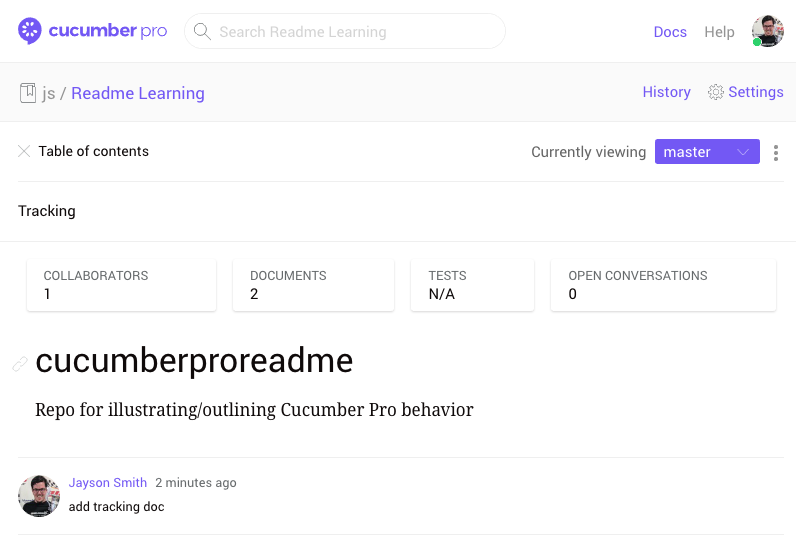
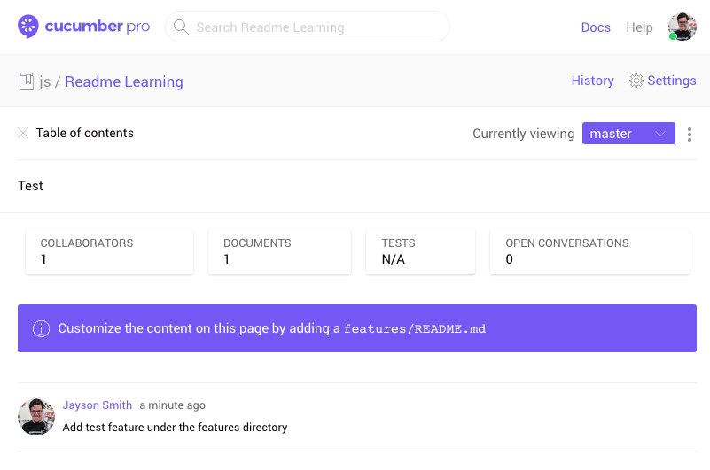

# Tracking

This doc with document the project's settings and coordinating Cucumber Pro behavior.

## #1 - Basic, no features

### Project Structure

```
.
├── assets
├── features
├── README.md
└── TRACKING.md
```

### Cucumber Pro Output



## #2 - Single feature under /features

### Project Structure

```
.
├── assets
│  └── 1.png
├── features
│  └── test.feature
├── README.md
└── TRACKING.md
```

### Cucumber Pro Output

