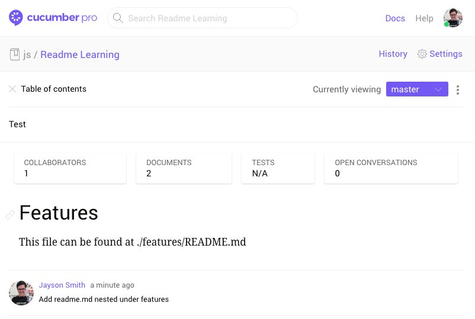
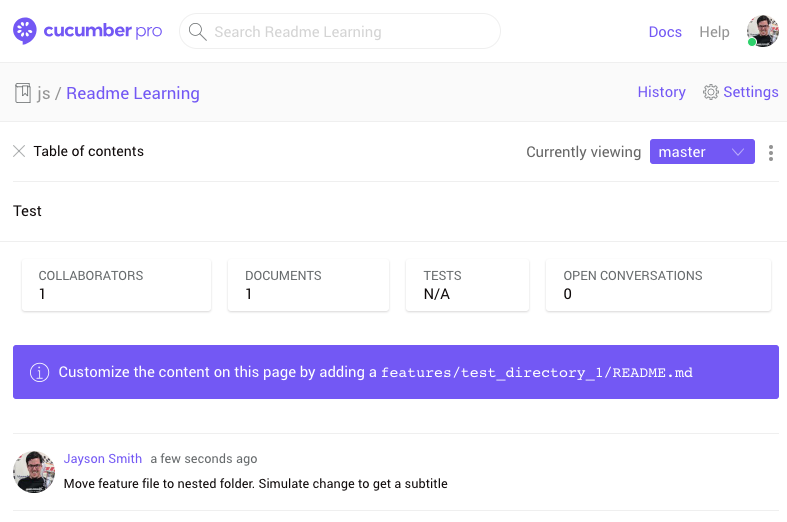
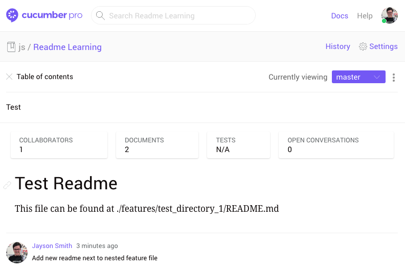
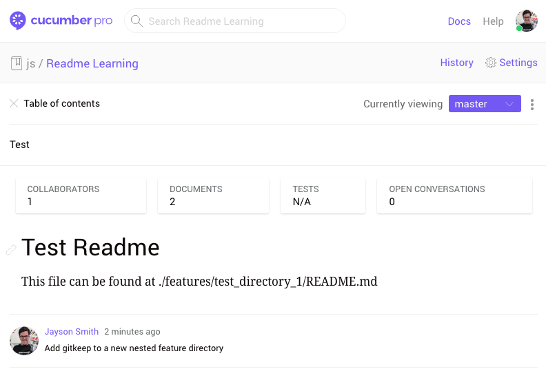
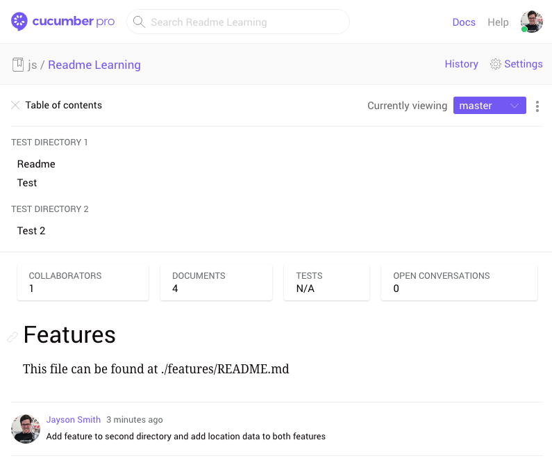

# Tracking

This doc with document the project's settings and coordinating Cucumber Pro behavior. There is an assets directory that contains the screenshots used in this file that I have removed from the directory structures below.

## #1 - Basic, no features

*Note: This example's readme in the project root looks to be ignored moving forward in the Cutter (2018-07-19) release but I'm assuming it's not on master yet?*

### Project Structure

```
.
├── features
├── README.md
└── TRACKING.md
```

### Cucumber Pro Output


## #2 - Single feature under /features

### Project Structure

```
.
├── features
│  └── test.feature
├── README.md
└── TRACKING.md
```

### Cucumber Pro Output


## #3 - Single feature under /features with matching README

### Project Structure

```
.
├── features
│  ├── README.md
│  └── test.feature
├── README.md
└── TRACKING.md
```

### Cucumber Pro Output



## #4 - Nest feature under /features/test_directory_1 with README still under /features

This example is one in which I could see someone (like myself) setting up a project's landing page under /features and deciding to group features into directories for organization, especially with Pro's table of contents. 

Note that the table of contents does not reflect that the directory exists.

### Project Structure

```
.
├── features
│  ├── README.md
│  └── test_directory_1
│     └── test.feature
├── README.md
└── TRACKING.md
```

### Cucumber Pro Output



## #5 - Add nested readme to above project

This example is one that follows Pro's recommendation of putting a readme in the same nested directory as the feature. It unfortunately then ignores the landing page readme. The table of contents still does not show the directory that the feature is in.

### Project Structure

```
.
├── features
│  ├── README.md
│  └── test_directory_1
│     └── test.feature
├── README.md
└── TRACKING.md
```

### Cucumber Pro Output



## #6 - Add new nested directory, but only add .gitkeep

No change

### Project Structure

```
.
├── features
│  ├── README.md
│  ├── test_directory_1
│  │  ├── README.md
│  │  └── test.feature
│  └── test_directory_2
│     └── .gitkeep
├── README.md
└── TRACKING.md
```

### Cucumber Pro Output



## #7 - Two features nested in their own directories

This example is where we get what is more along the lines of what I would consider the standard/idiomatic Cucumber Pro setup. Pro is correctly showing the landing page as well as the directories in the table of contents.

### Project Structure

```
.
├── features
│  ├── README.md
│  ├── test_directory_1
│  │  ├── README.md
│  │  └── test.feature
│  └── test_directory_2
│     └── test_2.feature
├── README.md
└── TRACKING.md
```

### Cucumber Pro Output

